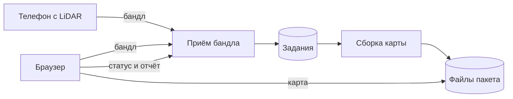

# 02. Стейкхолдеры, границы, альтернативы

## 2.1 Стейкхолдеры

Первые три строки — пользователи. Четвёртая — не пользователь: человек, который может случайно попасть на видео, и владелец снимаемого места.

| Роль | Интерес | Влияние | Что требуют |
|------|---------|---------|-------------|
| Оператор съёмки | Понять до отправки, годится ли запись, и не переснимать зону вслепую | Высокое: определяет качество входных данных | Зона на экране, проверка записи перед сохранением, понятная причина отказа |
| Сборщик карты | Запустить обработку без ручной сборки, прочитать отчёт и пройти по карте в браузере до передачи пакета | Высокое: основной пользователь системы | Загрузка бандла, очередь и статус, отчёт, ходьба по коллизии |
| Разработчик игры | Забрать пакет без ручной доводки геометрии и сам выбрать масштаб персонажа | Высокое: задаёт состав выходного пакета | Размеры от датчика и ось в манифесте, геометрия не масштабируется, лёгкие визуал и коллизия, оба файла открываются |
| Человек в кадре и владелец места | Не оказаться на видео и в материалах, которые потом смотрят другие | На функции почти не влияет. Лицо крупным планом останавливает выпуск записи | Снимать пол, стол или макет; в проверочных записях нет лиц крупным планом |

Интерес — насколько роль зависит от результата. Влияние — насколько роль меняет требования.

```text
                    Интерес →
                 Низкий              Высокий
           ┌───────────────────┬────────────────────────┐
  Высокое  │                   │ Оператор съёмки        │
  влияние  │                   │ Сборщик карты          │
           │                   │ Разработчик игры       │
           ├───────────────────┼────────────────────────┤
  Низкое   │                   │ Человек в кадре        │
           │                   │ и владелец места       │
           └───────────────────┴────────────────────────┘
```

## 2.2 Границы релиза

### Входит

- Съёмка на iPhone или iPad с LiDAR: зона, обход, проверка записи, отправка бандла на сервер
- Сборка карты в размерах датчика и отчёт с метриками
- Отказ на непригодном входе вместо произвольной геометрии
- Приём бандла, очередь заданий, статус и выдача пакета
- Задания, метрики и ссылки на файлы хранятся; сами файлы пакета лежат отдельно
- Браузер: загрузка бандла, список своих заданий, отчёт, просмотр карты и ходьба по коллизии рядом с исходным кадром
- Открытое описание обмена: что принимается, что отдаётся, примеры успеха и отказа
- Сервис открывается по публичной ссылке. Пароли в собранную программу не входят. Среду можно поднять заново
- Проверочные записи: две пригодные и две непригодные

### Не входит

- Масштабирование карты под конкретный геймплей
- Полноценная игра и обязательная демонстрация в Unreal
- Обучение собственной модели глубины
- Android как платформа приёмки
- Отдельная панель администрирования
- Сборка без глубины LiDAR. Она запускается только если этот способ включён в настройках и на приёмку релиза не влияет

### После релиза

Android в приёмке, текстуры, второй уровень детализации, собственная модель глубины.

## 2.3 Допущения

1. Для записи есть телефон с LiDAR.
2. Оператор и сборщик могут быть одним человеком.
3. Разработчик игры умеет открыть GLB.

## 2.4 Ограничения

1. Обязательная платформа съёмки — iOS и iPadOS на устройстве с LiDAR. Запись в симуляторе и в браузере не поддерживается.
2. Зона по умолчанию 80×80 см выбрана из-за объёма вычислений. Размер настраивается, пороги качества заданы для значения по умолчанию.
3. Обычный обход идёт с высоты около 0,5–0,8 м. Это способ съёмки, не причина отказа.
4. Пайплайн не меняет масштаб геометрии. Меш только центрируется, и это фиксируется в манифесте.
5. Формат карты задаёт glTF, съёмку — ARKit и LiDAR.

## 2.5 Альтернативы

| Вариант | Плюс | Минус для продукта |
|---------|------|--------------------|
| Ручная фотограмметрия с доводкой в редакторе | Привычный путь к мешу | Не повторяется одной командой и не даёт единого пакета из визуала и коллизии |
| Сборка только по картинке, без LiDAR | Не нужен датчик глубины | Нет надёжных размеров в метрах. Остаётся выключенным способом и не заменяет LiDAR |

**Выбор:** съёмка с LiDAR, сборка на сервере, пакет GLB и проверка коллизии в браузере.

## 2.6 Как части связаны

Телефон с LiDAR пишет бандл и отправляет его на сервер. Тот же бандл можно загрузить в браузере. Сервер ставит задание в очередь и хранит его статус. Отдельная программа забирает задание и собирает карту. Файлы пакета лежат в хранилище, браузер скачивает их оттуда и показывает ходьбу по коллизии рядом с кадром съёмки.

Приём бандла и выдача пакета закрыты ключом доступа. Это часть запроса к серверу. Повторная отправка того же бандла возвращает текущее задание. Новый запрос запускает сборку заново.

Сборка без глубины LiDAR запускается только если этот способ включён в настройках. На приёмку этого релиза она не влияет. Если меш получается крупнее 8 м, его не уменьшают: карта остаётся в размерах датчика.


