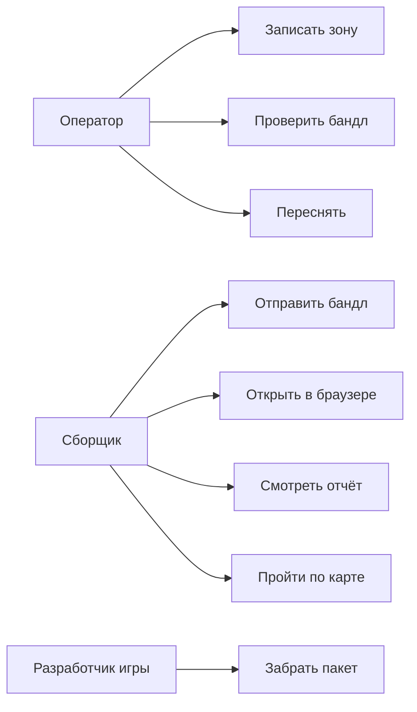

# 03. Персоны, сценарии, варианты использования

## 3.1 Персоны

Оператор и сборщик могут быть одним человеком. У разработчика игры своего экрана нет.

### Оператор съёмки

Снимает участок пола, стола или макета на телефоне с LiDAR. До отправки хочет понять, годится ли обход.

- **Цель:** получить бандл с видео, позами, метаданными и глубиной.
- **Боль:** не видно, что обход слишком короткий, зона слишком большая или пропала траектория камеры.

### Сборщик карты

Отправляет бандл и следит за сборкой. Решает по отчёту и по ходьбе в браузере, отдавать ли пакет дальше.

- **Цель:** запустить сборку без ручной команды и пройти по карте до передачи пакета.
- **Боль:** отказ без текста; нельзя понять, держит ли коллизия, пока карту не откроют в игре.

### Разработчик игры

Забирает пять файлов. Ему нужны метры как есть и лёгкая коллизия. Масштаб персонажа он выставляет сам.

## 3.2 Сценарии

### Пригодная съёмка

| Шаг | Что происходит |
|-----|----------------|
| Начало | Оператор открывает запись и видит на полу рамку зоны около 80×80 см |
| Основной путь | Обходит зону 10–30 с. Проверка проходит, бандл уходит на сервер. Задание завершается успехом |
| Развилка | Если сборка падает, в отчёте видна причина, зону переснимают |
| Завершение | Сборщик проходит по карте от края до края и передаёт пакет разработчику игры |

### Непригодная съёмка

| Шаг | Что происходит |
|-----|----------------|
| Начало | Запись короче 10 с, длиннее 30 с, снята с места без обхода или без корректных поз |
| Основной путь | Проверка на телефоне или сборка на сервере останавливается отказом |
| Ошибка | Причина видна одной фразой |
| Завершение | Оператор переснимает зону. Непригодная запись не становится картой |

### Повторная отправка

| Шаг | Что происходит |
|-----|----------------|
| Начало | Загрузка оборвалась, сборщик отправляет тот же бандл снова |
| Основной путь | Сервер возвращает текущее задание |
| Развилка | Если первое задание уже упало, виден его отказ |
| Завершение | Вторая сборка не стартует, в списке одно задание |

### Открыть свои карты в браузере

| Шаг | Что происходит |
|-----|----------------|
| Начало | На сервере уже несколько заданий этого человека. Он один раз нажимает «Открыть в браузере» |
| Основной путь | Браузер получает сессию. «Мои задания» показывает все его строки: дата и статус. Из строки открываются отчёт и ходьба, затем он возвращается к списку |
| Ошибка | Ссылка протухла или её уже открыли. Кнопка на телефоне запрашивает новую. Чужой браузер видит пустой вход. Задания в базе при этом остаются |
| Завершение | Все карты этого человека доступны из одного списка. Новая ссылка с телефона нужна только когда сессия кончилась |

### Та же съёмка ещё раз

| Шаг | Что происходит |
|-----|----------------|
| Начало | Тот же бандл собирают заново |
| Основной путь | Сборка идёт ещё раз |
| Ошибка | Способ построения другой или число треугольников разошлось больше чем на 15% |
| Завершение | Тот же способ построения, расхождение по треугольникам не больше 15% |

## 3.3 Варианты использования

| Вариант | Предусловия | Основной поток | Результат или ошибка |
|---------|-------------|----------------|----------------------|
| Записать | Телефон с LiDAR, камера готова | Навести на участок, начать запись, обойти зону, остановить | Видео, позы, метаданные, глубина и якорь зоны |
| Проверить | Есть запись | Длительность 10–30 с, путь камеры не меньше 0,28 м, поворот не меньше 90°, зона не больше 0,92 м, есть позы и глубина | «Готово» или причина отказа и «Переснять» |
| Переснять | Проверка не прошла | Кнопка ведёт обратно в запись | Новый бандл |
| Отправить | Состав бандла проверен | Отправка с телефона или форма в браузере, постановка в очередь | Ошибка сбоя показана текстом. Повторная отправка того же бандла возвращает текущее задание |
| Открыть в браузере | Бандл отправлен, ключ есть на телефоне | Одноразовая ссылка, сессия в браузере, список своих заданий | Протухшая ссылка заменяется новой с телефона. Без сессии чужие карты не видны |
| Отчёт | Есть задание | Статус, способ построения, метрики | На отказе — текст причины |
| Пройти по карте | Сборка успешна | Загружается коллизия, рядом кадр с той же камеры, размер персонажа задаётся при показе | Персонаж стоит на поверхности и проходит край–край |
| Забрать пакет | Сборка успешна | Скачать пять файлов | Масштаб персонажа выставляется в игре |
