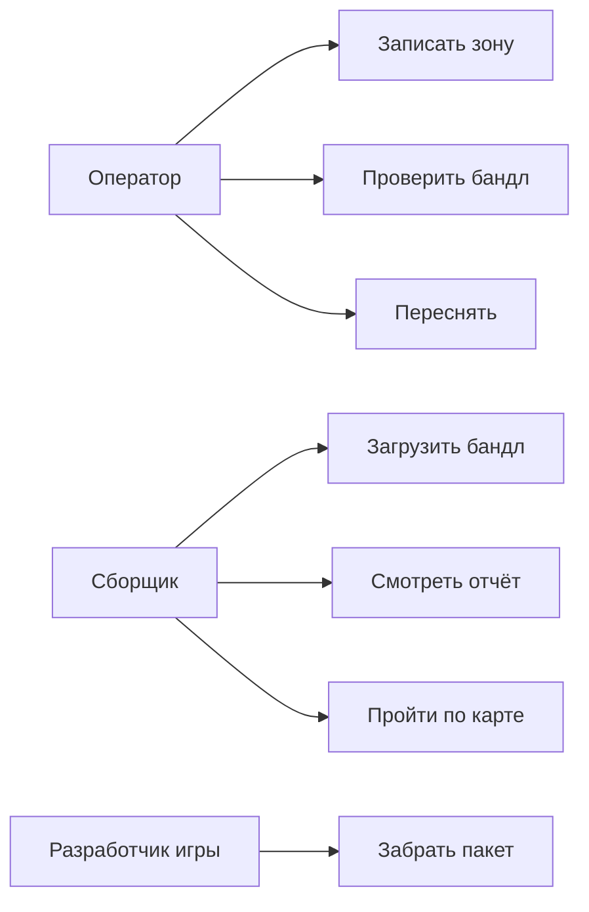

# 03. Персоны, сценарии, use cases

## 3.1 Персоны

### Оператор съёмки

| | |
|--|--|
| Цель | Снять участок и до отправки понять, годится ли запись |
| Навыки | Смартфон; без опыта 3D-пайплайнов |
| Боли | Неясный размер зоны; съёмка «с места»; отказ без объяснения |
| Цитата | «Покажите квадрат и скажите, когда остановиться» |
| Экраны | Запись, проверка, ошибка / пересъёмка |

### Сборщик карты

| | |
|--|--|
| Цель | Загрузить бандл → отчёт → пройти по коллизии |
| Навыки | Уверенный пользователь веба |
| Боли | Нет статуса; отказ без текста; проверка только после импорта в движок |
| Цитата | «Нужны отчёт и ходьба в браузере, не редактор» |
| Экраны | Загрузка, задания, отчёт, просмотр |

### Разработчик игры

| | |
|--|--|
| Цель | Импортировать карту и сам выбрать масштаб персонажа |
| Навыки | Импорт glTF |
| Боли | Неясные единицы; меш «подогнан» под чужой рост; тяжёлая коллизия |
| Цитата | «Дайте метры как есть — масштаб выставлю у себя» |
| Экраны | Скачивание пакета (отдельного UI нет) |

---

## 3.2 Сценарии

### SC-1. Успешная съёмка и сборка

1. Оператор видит зону ~80×80 см, фиксирует её, обходит 10–30 с.  
2. Preflight OK → бандл готов.  
3. Сборщик загружает бандл → задание в очереди → `success`.  
4. Сборщик ходит по карте: стоит на поверхности, проходит край–край.  
5. Пакет можно отдать разработчику игры.

### SC-2. Плохая съёмка

1. Слишком коротко / без обхода / без поз.  
2. Preflight или сборка → отказ с текстом.  
3. Оператор переснимает → SC-1.

### SC-3. Повтор с тем же ключом идемпотентности

Повторная отправка → то же задание, вторая сборка не стартует.

### SC-4. Второй прогон с новым ключом

Новая сборка того же бандла → тот же метод реконструкции, близкое число треугольников (допуск ±15%).

### SC-5. Резерв без LiDAR-глубины

Бандл без глубины, в конфиге включён монокуляр → отдельный путь, не основной релизный критерий.

---

## 3.3 Use cases

| UC | Предусловия | Основной поток | Результат / ошибка |
|----|-------------|----------------|--------------------|
| UC-1 Записать | LiDAR, камера, AR готов | Навести → Record → орбита → Stop | Файлы + `zone_anchor`; сбой трекинга → подсказка |
| UC-2 Проверить | Есть запись | Preflight: 10–30 с, path ≥ 0,28 м, yaw ≥ 90°, span ≤ 0,92 м, позы, глубина | «Готово» или причина + «Переснять» |
| UC-3 Переснять | Отказ | CTA → UC-1 | Новый бандл |
| UC-4 Загрузить | Ключ доступа, состав файлов OK | Upload → очередь → сборка | 401/403/500 текстом; обрыв → retry, без «тихого» job |
| UC-5 Отчёт | Есть задание | Показ статуса и метрик | На fail — текст причины |
| UC-6 Ходьба | Успешная сборка | `collision.glb` + кадр; размер персонажа при показе | Проверка проходимости |
| UC-7 Забрать пакет | Успех | Скачать 5 файлов | Масштаб персонажа — в движке |
