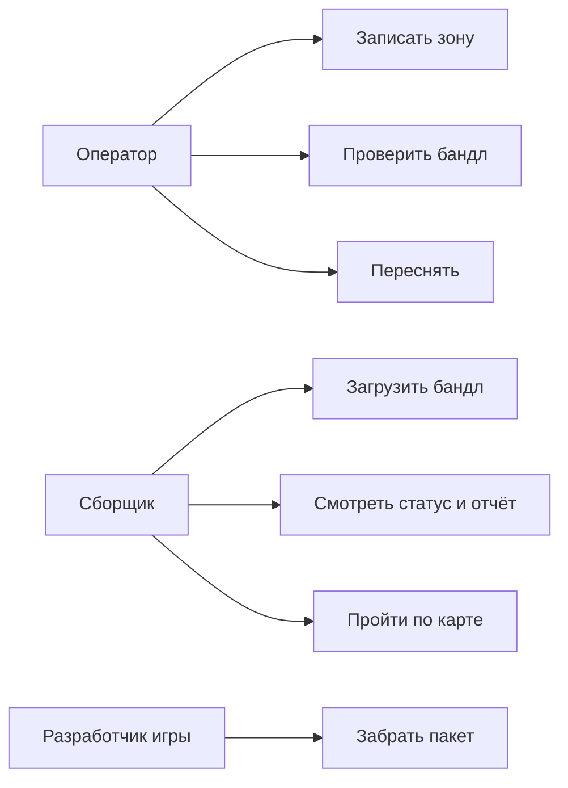

# 03. Персоны, сценарии, use cases

## 3.1 Персоны

Персоны взяты из ролей раздела 2.1. Экраны есть у двух из них: оператора и сборщика. Оператор и сборщик могут быть одним человеком.

### Оператор съёмки

| | |
|--|--|
| Цель | Снять участок и до отправки понять, годится ли запись |
| Навыки | Уверенно пользуется смартфоном, опыта с 3D нет |
| Боли | Непонятно, какой участок снимать; съёмка с одной точки; отказ без объяснения |
| Цитата | «Покажите квадрат и скажите, когда остановиться» |
| Экраны | Запись, проверка бандла, ошибка и пересъёмка |

### Сборщик карты

| | |
|--|--|
| Цель | Загрузить бандл, получить отчёт и пройти по карте |
| Навыки | Уверенный пользователь веба |
| Боли | Не видно статуса; отказ без текста; проверить карту можно только после импорта в движок |
| Цитата | «Мне нужны отчёт и ходьба в браузере, а не редактор» |
| Экраны | Загрузка, задания, отчёт, просмотр карты |

### Получатель пакета: разработчик игры

У разработчика игры своего экрана нет: он забирает файлы пакета, которые передал сборщик.

| | |
|--|--|
| Цель | Импортировать карту и самому выбрать масштаб персонажа |
| Боли | Непонятные единицы; меш подогнан под чужой рост; тяжёлая коллизия |
| Цитата | «Дайте метры как есть, масштаб я выставлю у себя» |

---

## 3.2 Сценарии

### SC-1. Пригодная съёмка

| Шаг | Что происходит |
|-----|----------------|
| Начало | Оператор открывает запись и видит на полу рамку зоны около 80×80 см |
| Основной путь | Фиксирует зону, обходит её 10–30 с, проверка бандла проходит. Сборщик загружает бандл в браузере, задание уходит в очередь и завершается успехом |
| Развилка | Если сборка падает, сборщик видит причину в отчёте и переходит в SC-2 |
| Завершение | Сборщик проходит по карте от края до края и передаёт пакет разработчику игры |

### SC-2. Непригодная съёмка

| Шаг | Что происходит |
|-----|----------------|
| Начало | Запись короче 10 с, длиннее 30 с, снята с места без обхода или без корректных поз |
| Основной путь | Запись останавливается на проверке бандла либо сборка получает отказ |
| Ошибка | Причина видна на экране телефона или в отчёте задания одной фразой |
| Завершение | Оператор переснимает зону и возвращается в SC-1 |

### SC-3. Повтор с тем же ключом

| Шаг | Что происходит |
|-----|----------------|
| Начало | Загрузка оборвалась, и сборщик отправляет тот же бандл с тем же ключом идемпотентности |
| Основной путь | Система возвращает текущее задание |
| Развилка | Если первое задание уже упало, сборщик видит его отказ, а не новую сборку |
| Завершение | Вторая сборка не стартует, в списке одно задание |

### SC-4. Второй прогон

| Шаг | Что происходит |
|-----|----------------|
| Начало | Сборщик отправляет тот же бандл с новым ключом |
| Основной путь | Сборка идёт заново |
| Ошибка | Метод другой или треугольников больше чем на 15% отличается от первого прогона — прогон считается невоспроизводимым |
| Завершение | Тот же метод, расхождение по треугольникам не больше 15% |

### SC-5. Резервный режим

| Шаг | Что происходит |
|-----|----------------|
| Начало | Тот же материал без глубины, в конфиге выбран монокуляр |
| Основной путь | Сборка идёт по монокулярной оценке глубины |
| Развилка | Без выбранного монокуляра бандл без глубины получает отказ |
| Завершение | Результат смотрят отдельно; на обязательную приёмку этот путь не влияет |

---

## 3.3 Use cases

Оператор записывает зону, проверяет бандл и переснимает. Сборщик загружает бандл, читает статус с отчётом и проходит по карте в браузере. Разработчик игры забирает пакет.

| UC | Предусловия | Основной поток | Результат или ошибка |
|----|-------------|----------------|----------------------|
| UC-1 Записать | Устройство с LiDAR, AR готов | Навести на участок, начать запись, обойти зону, остановить | Видео, позы, метаданные, глубина и якорь зоны; при сбое трекинга — подсказка |
| UC-2 Проверить | Есть запись | Проверка: 10–30 с, путь камеры не меньше 0,28 м, поворот не меньше 90°, зона не больше 0,92 м, позы, глубина | «Готово» или причина отказа и «Переснять» |
| UC-3 Переснять | Проверка не прошла | Кнопка ведёт обратно в запись | Новый бандл |
| UC-4 Загрузить | Ключ доступа, состав бандла проверен формой | Загрузка, постановка в очередь, сборка | Ошибки 401, 403, 404, 500 показаны текстом; есть состояние ожидания; при обрыве — повтор с тем же ключом |
| UC-5 Отчёт | Есть задание | Статус, метод, метрики | На отказе — текст причины |
| UC-6 Ходьба | Сборка успешна | Загружается `collision.glb`, рядом кадр с той же камеры, размер персонажа задаётся при показе | Персонаж стоит на поверхности и проходит край–край |
| UC-7 Забрать пакет | Сборка успешна | Скачать пять файлов | Масштаб персонажа выставляется в движке |
