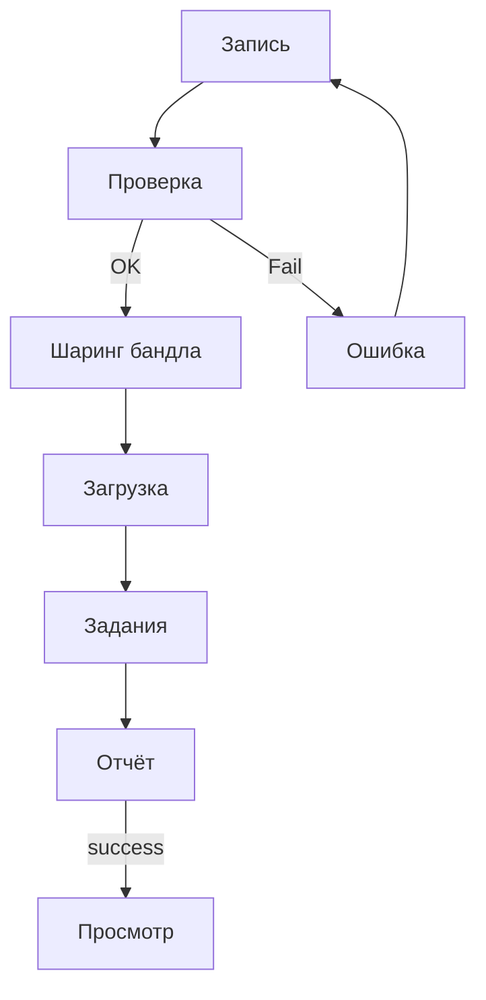

# 05. Экраны, стиль, usability

Макеты: [`wireframes/index.html`](wireframes/index.html)

## 5.1 Стиль

| Токен | Значение | Назначение |
|-------|----------|------------|
| Accent | `#00BFA5` | CTA, акцент |
| Success | `#4CAF50` | Успех |
| Warning | `#FF9800` | Зона зафиксирована |
| Error | `#EF5350` | Отказ, запись |
| Mobile bg | `#0B0D10` | Overlay камеры |
| Browser bg | `#F7F8FA` | Страницы SPA |

Шрифты: system на телефоне; IBM Plex Sans / Mono в браузере.  
Tap target ≥ 44 pt. Состояния: default, focus, disabled, loading, error, success.

## 5.2 Телефон

| Экран | Содержание |
|-------|------------|
| M1 Запись | AR, рельсы зоны (зелёные → оранжевые после lock), подсказка обхода, таймер до 30 с, Запись/Стоп |
| M2 Проверка | Чеклист 10–30 с / path / yaw / span / позы / глубина → «Готово» или отказ |
| M3 Ошибка | Текст причины + «Переснять» |

В приложении съёмки нет облачной отправки карты и in-app 3D-просмотра.

## 5.3 Браузер

| Экран | Содержание |
|-------|------------|
| B1 Загрузка | Файл, ключ доступа, ключ идемпотентности, проверка состава |
| B2 Задания | Список с фильтром queued / running / success / fail |
| B3 Отчёт | Статус, метод, метрики, ошибка; ссылка на карту |
| B4 Просмотр | Ходьба по collision; кадр рядом; размер персонажа при показе |

## 5.4 Переходы

## 5.5 Тексты ошибок

| Ситуация | Текст |
|----------|-------|
| duration | «Запись должна длиться от 10 до 30 секунд» |
| no_orbit | «Нужен обход зоны: пройдите вокруг участка» |
| zone_too_large | «Зона слишком большая — снимите участок около 80×80 см» |
| poses | «Нет корректной траектории камеры — переснимите при стабильном AR» |
| depth | «Нет кадров глубины LiDAR — нужен iPhone или iPad Pro» |
| auth | «Нет доступа — проверьте ключ» |
| build_fail | «Сборка не удалась: {reason}» |

## 5.6 Usability зоны и обхода

| | |
|--|--|
| Участники | 5 человек без 3D-подготовки |
| Задачи | Куда целиться; как обходить; что делать при отказе |
| Порог | ≥ 4 из 5 верно по всем трём (KPI-1) |

| # | Участник | Зона | Обход | Готовность | Замечания |
|---|----------|------|-------|------------|-----------|
| 1–5 | | ☐ | ☐ | ☐ | |

Прогон ещё не выполнен — нужен до фиксации текстов подсказок.

### Доступность

- Контраст AA; подписи не только цветом  
- Клавиатура на формах браузера; видимый focus  
- Текстовые ошибки  
