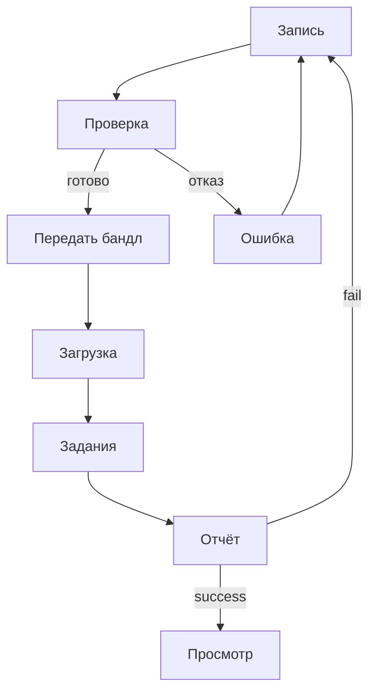

# 05. Экраны и стиль

Схемы экранов: [`wireframes/index.html`](wireframes/index.html). Каждый экран связан со сценарием из раздела 03.

## 5.1 Стиль

| Токен | Значение | Назначение |
|-------|----------|------------|
| Акцент | `#00BFA5` | Основные кнопки, активные элементы |
| Успех | `#4CAF50` | Пройденная проверка, `success` |
| Внимание | `#FF9800` | Зона зафиксирована, идёт запись |
| Ошибка | `#EF5350` | Отказ, кнопка записи |
| Фон телефона | `#0B0D10` | Слой поверх камеры |
| Фон браузера | `#F7F8FA` | Страницы веб-клиента |

**Шрифты.** На телефоне системный шрифт. В браузере IBM Plex Sans для текста и IBM Plex Mono для идентификаторов и метрик.

**Сетка.** Телефон: экран 320 pt по ширине, поля 20 pt, отступ между блоками 16 pt; управление внизу, в пределах безопасной зоны. Браузер: шапка с навигацией, основная колонка с полями 22–24 px; формы не шире 520 px; метрики отчёта в карточках от 160 px; просмотр карты делится на 3D-область и боковую панель с кадром, на узком экране панель уходит вниз.

**Состояния компонентов:** обычное, фокус, недоступно, ожидание, ошибка, успех. Зона нажатия не меньше 44 pt.

## 5.2 Телефон

| Экран | Сценарий | Содержание |
|-------|----------|------------|
| [Сканирование](wireframes/m1-record.html) | Пригодная съёмка | Вкладки «Сканировать» и «Мои карты», шаги Зона → Запись → Обход → Проверка, статус AR, кнопка «Запись» / «Стоп» |
| [Карта готова](wireframes/m2-preflight.html) | Пригодная съёмка | Лист после остановки: проверка пройдена, «Отправить бандл» |
| [Лучше переснять](wireframes/m3-error.html) | Непригодная съёмка | Причина отказа и «Переснять» |
| [Мои карты](wireframes/m4-maps.html) | Пригодная съёмка | Пустой список либо карточка съёмки: отправить и удалить |

Из приложения съёмки бандл уходит на сервер. Карту в приложении не посмотреть: её открывают в браузере.

## 5.3 Браузер

| Экран | Сценарий | Содержание |
|-------|----------|------------|
| [Загрузка](wireframes/b1-upload.html) | Пригодная съёмка, повторная отправка | Файл бандла, проверка состава до отправки |
| [Задания](wireframes/b2-jobs.html) | Пригодная съёмка, повторная отправка, та же съёмка ещё раз | Список своих заданий с фильтром: в очереди, собирается, готово, отказ |
| [Отчёт](wireframes/b3-report.html) | Пригодная и непригодная съёмка | Статус, способ построения, метрики, текст ошибки; переход к карте и скачивание пакета |
| [Просмотр](wireframes/b4-viewer.html) | Пригодная съёмка | Ходьба по коллизии, исходный кадр рядом, размер персонажа задаётся при показе |

## 5.4 Переходы

## 5.5 Тексты ошибок

| Ситуация | Текст |
|----------|-------|
| Длительность | «Запись должна длиться от 10 до 30 секунд» |
| Нет обхода | «Нужен обход зоны: пройдите вокруг участка» |
| Зона слишком большая | «Зона слишком большая — снимите участок около 80×80 см» |
| Позы | «Нет корректной траектории камеры — переснимите при стабильном AR» |
| Глубина | «Нет кадров глубины LiDAR — нужен iPhone или iPad Pro» |
| Состав бандла | «В бандле не хватает файла: {имя}» |
| Задание не найдено | «Задание не найдено — проверьте ссылку» |
| Ошибка сервера | «Сервер не ответил — отправьте бандл ещё раз» |
| Сборка | «Сборка не удалась: {причина}» |

## 5.6 Чеклист доступности

- [ ] Контраст текста не ниже AA; статус передаётся не только цветом
- [ ] Зоны нажатия не меньше 44 pt
- [ ] У полей, кнопок и статусов есть подписи
- [ ] Формы браузера проходятся с клавиатуры, фокус виден
- [ ] Ошибки показаны текстом
