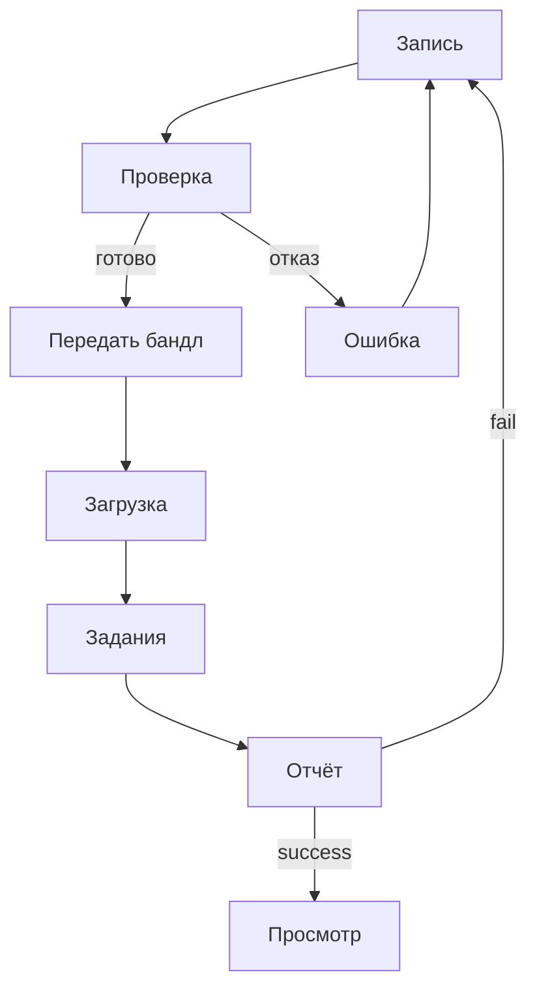

# 05. Экраны и стиль

Макеты: [`wireframes/index.html`](wireframes/index.html). Каждый экран связан со сценарием из раздела 03.

## 5.1 Стиль

| Токен | Значение | Назначение |
|-------|----------|------------|
| Акцент | `#00BFA5` | Основные кнопки, активные элементы |
| Успех | `#4CAF50` | Пройденная проверка, `success` |
| Внимание | `#FF9800` | Зона зафиксирована, идёт запись |
| Ошибка | `#EF5350` | Отказ, кнопка записи |
| Фон телефона | `#0B0D10` | Слой поверх камеры |
| Фон браузера | `#F7F8FA` | Страницы веб-клиента |

**Шрифты.** На телефоне системный шрифт. В браузере IBM Plex Sans для текста и IBM Plex Mono для идентификаторов и метрик.

**Сетка.** Телефон: экран 320 pt по ширине, поля 20 pt, отступ между блоками 16 pt; управление внизу, в пределах безопасной зоны. Браузер: шапка с навигацией, основная колонка с полями 22–24 px; формы не шире 520 px; метрики отчёта в карточках от 160 px; просмотр карты делится на 3D-область и боковую панель с кадром, на узком экране панель уходит вниз.

**Состояния компонентов:** обычное, фокус, недоступно, ожидание, ошибка, успех. Зона нажатия не меньше 44 pt.

## 5.2 Телефон

| Экран | Сценарий | Содержание |
|-------|----------|------------|
| M1 Сканирование | Пригодная съёмка | Вкладки «Сканировать» и «Мои карты», шаги Зона → Запись → Обход → Проверка, статус AR, кнопка «Запись» / «Стоп» |
| M2 Карта готова | Пригодная съёмка | Лист после остановки: проверка пройдена, «Поделиться бандлом» |
| M3 Лучше переснять | Непригодная съёмка | Съёмка сохранена, причина, «Переснять» или «Оставить как есть» |
| M4 Мои карты | Пригодная съёмка | Пустой список либо карточка съёмки: поделиться и удалить |

Из приложения съёмки бандл не отправляется на сервер, и карту в нём не посмотреть: бандл передаётся сборщику и загружается в браузере.

## 5.3 Браузер

| Экран | Сценарий | Содержание |
|-------|----------|------------|
| B1 Загрузка | SC-1, SC-3 | Файл бандла, ключ доступа, проверка состава до отправки |
| B2 Задания | SC-1, SC-3 | Список своих заданий с фильтром: в очереди, собирается, готово, отказ |
| B3 Отчёт | SC-1, SC-2 | Статус, метод, метрики, текст ошибки; переход к карте и скачивание пакета |
| B4 Просмотр | SC-1 | Ходьба по коллизии, исходный кадр рядом, размер персонажа задаётся при показе |

## 5.4 Переходы

## 5.5 Тексты ошибок

| Ситуация | Текст |
|----------|-------|
| Длительность | «Запись должна длиться от 10 до 30 секунд» |
| Нет обхода | «Нужен обход зоны: пройдите вокруг участка» |
| Зона слишком большая | «Зона слишком большая — снимите участок около 80×80 см» |
| Позы | «Нет корректной траектории камеры — переснимите при стабильном AR» |
| Глубина | «Нет кадров глубины LiDAR — нужен iPhone или iPad Pro» |
| Состав бандла | «В бандле не хватает файла: {имя}» |
| Доступ | «Нет доступа — проверьте ключ» |
| Задание не найдено | «Задание не найдено — проверьте ссылку» |
| Ошибка сервера | «Сервер не ответил — отправьте бандл ещё раз» |
| Сборка | «Сборка не удалась: {причина}» |

## 5.6 Чеклист доступности

- [ ] Контраст текста не ниже AA; статус передаётся не только цветом
- [ ] Зоны нажатия не меньше 44 pt
- [ ] У полей, кнопок и статусов есть подписи
- [ ] Формы браузера проходятся с клавиатуры, фокус виден
- [ ] Ошибки показаны текстом
