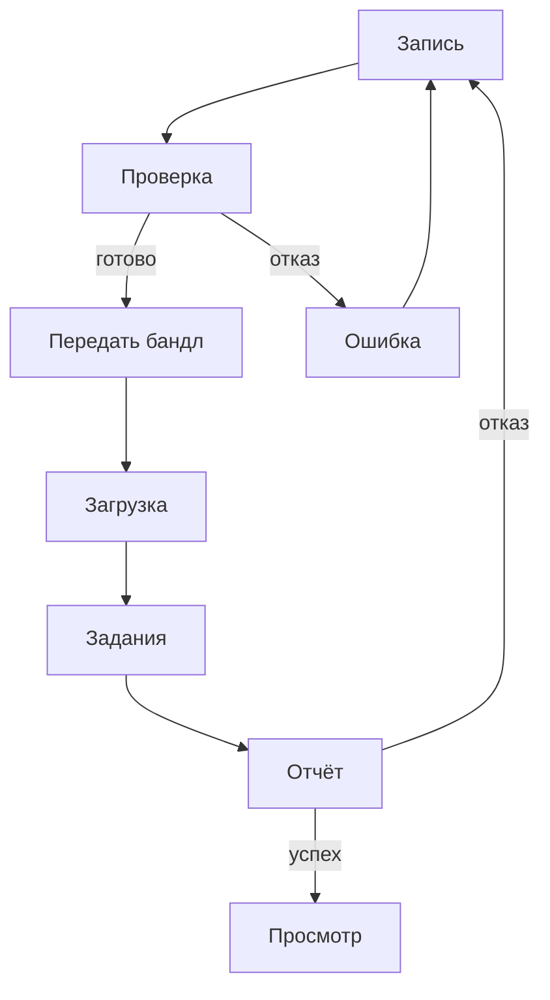

# Бизнес-анализ: система создания игровых 3D-карт по видеозаписи

**Продукт:** NVC Maps  
**English:** A System for Creating 3D Game Maps from Video

Макеты экранов: [kalashnikovkv.github.io/nvc-business-analysis](https://kalashnikovkv.github.io/nvc-business-analysis/)

---

## 1. Резюме, проблема, цели

### 1.1 Резюме

NVC Maps превращает короткую съёмку участка поверхности на телефоне с LiDAR в пакет игровой карты: визуальный меш, коллизию и отчёт о качестве. Обработка идёт на сервере, результат открывается в браузере. Сборщик проходит по коллизии и сравнивает меш с исходным кадром съёмки. Разработчик игры забирает GLB и сам выбирает масштаб персонажа.

### 1.2 Проблема

| Сейчас | Нужно |
|--------|--------|
| Есть видео реального места | Упрощённый визуал и отдельная коллизия в размерах, которые дал датчик |
| Карту собирают ручной фотограмметрией и правят в редакторе | Один воспроизводимый прогон без ручной доводки геометрии |
| Чтобы понять, можно ли по карте ходить, ставят движок | Проверка в браузере до импорта |
| Нет единого пакета «визуал + коллизия + метрики» | Пакет из пяти файлов и явный отказ с причиной |

Ручная фотограмметрия с доводкой в редакторе не повторяется одной командой и не даёт единого пакета из визуала и коллизии. Поэтому из короткой съёмки нельзя быстро получить карту, которую можно проверить без движка и отдать в игру в честных размерах.

### 1.3 Цель продукта

Система превращает короткую съёмку участка на телефоне с LiDAR в пакет карты. Пакет открывается в браузере, его забирают в движок.

1. Принять бандл съёмки: видео, позы, метаданные, метрическая глубина LiDAR.
2. Собрать пакет `map.glb`, `collision.glb`, `manifest.json`, `bounds.json`, `report.json` в размерах датчика.
3. Дать сборщику пройти по коллизии в браузере и увидеть исходный кадр рядом с мешем.
4. На непригодном входе вернуть отказ с причиной. Геометрия-заглушка вместо карты не подставляется.

### 1.4 Видение

> Снял участок около 80×80 см, сервис собрал карту, проверил её ходьбой в браузере, забрал GLB в движок и сам выставил масштаб персонажа.

### 1.5 Критерии успеха

Успех измеряется критериями качества из раздела 7 технического задания. Ниже они записаны продуктовым языком.

| ID | Метрика | Порог |
|----|---------|-------|
| KPI-1 | Проверка без движка | Персонаж стоит на карте не менее 5 с, не проваливается и проходит её от края до края; рядом виден кадр съёмки |
| KPI-2 | Импорт в движок | Оба файла карты открываются; в манифесте метры, ось Y вверх и факт центрирования; масштаб геометрии не менялся |
| KPI-3 | Сквозной сценарий | По публичному адресу проходят загрузка бандла, статус и просмотр карты |
| KPI-4 | Лёгкая карта | Визуал не больше 50 000 треугольников; коллизия не больше 25% от визуала и не меньше 100 граней; визуал до 25 МБ, коллизия до 8 МБ |
| KPI-5 | Честный отказ | Пригодная запись собирается, непригодная получает отказ с текстом причины; вместо карты не подставляется заглушка |
| KPI-6 | Повторяемость | То же видео с теми же параметрами сборки даёт ту же карту: тот же метод и расхождение по треугольникам не больше 15% |

Покрытие тестами и устройство поставки в эти критерии не входят: они описаны в техническом задании.

### 1.6 Вне цели этого релиза

Полноценная игра; обязательный показ в Unreal; обучение собственной модели глубины; Android как платформа приёмки; изменение масштаба карты под рост персонажа.

---

## 2. Стейкхолдеры, границы, альтернативы

### 2.1 Стейкхолдеры

Первые три строки — пользователи. Четвёртая — не пользователь: человек, который может случайно попасть на видео, и владелец снимаемого места.

| Роль | Интерес | Влияние | Что требуют |
|------|---------|---------|-------------|
| Оператор съёмки | Понять до отправки, годится ли запись, и не переснимать зону вслепую | Высокое: определяет качество входных данных | Зона на экране, проверка записи перед сохранением, понятная причина отказа |
| Сборщик карты | Запустить обработку без ручной сборки команды, прочитать отчёт и пройти по карте в браузере до передачи пакета дальше | Высокое: основной пользователь системы | Загрузка бандла, очередь и статус, отчёт с метриками, ходьба по коллизии |
| Разработчик игры, level-дизайнер | Забрать карту в движок без ручной доводки геометрии и сам выбрать масштаб под своего персонажа | Высокое: формирует контракт выходного пакета | Размеры от датчика и ось в манифесте, геометрия не масштабируется, лёгкие визуал и коллизия, GLB открываются без ошибок |
| Человек в кадре и владелец места | Не оказаться на видео и в материалах, которые потом смотрят другие | На функции почти не влияют. Если в записи лицо крупным планом, выпуск останавливается | Снимать пол, стол или макет; в проверочных записях нет лиц крупным планом |

```text
                    Интерес →
                 Низкий              Высокий
           ┌───────────────────┬────────────────────────┐
  Высокое  │                   │ Оператор               │
  влияние  │                   │ Сборщик                │
           │                   │ Разработчик игры       │
           ├───────────────────┼────────────────────────┤
  Низкое   │                   │ Человек в кадре        │
           │                   │ (не пользователь)      │
           └───────────────────┴────────────────────────┘
```

### 2.2 Границы релиза

**Входит**

- Мобильная съёмка с LiDAR и схемы её экранов: зона, подсказки обхода, проверка записи
- Пайплайн сборки карты в размерах датчика и отчёт с метриками
- Отказ на непригодном входе вместо произвольной геометрии
- Приём бандла, очередь заданий, статус и выдача пакета; доступ по ключу
- Задания, метрики и ссылки на файлы хранятся; сами файлы пакета лежат отдельно
- Веб-клиент: загрузка бандла, список своих заданий, отчёт, просмотр карты и ходьба по коллизии рядом с исходным кадром
- Открытое описание API: что принимается, что отдаётся, примеры успеха и отказа
- Сервис открывается по публичной ссылке, пароли в собранную программу не входят, среду можно поднять заново
- Проверочные записи: две пригодные, одна без глубины для резервного режима, две непригодные

**Не входит**

- Масштабирование карты под конкретный геймплей
- Полноценная игра и обязательная демонстрация в Unreal
- Обучение собственной модели глубины
- Android как платформа обязательной приёмки
- Отдельная панель администрирования

**После релиза**

Отправка бандла прямо с телефона, проверка макетов съёмки на группе людей без подготовки по 3D, Android в приёмке, текстуры, второй уровень детализации, собственная модель глубины.

### 2.3 Допущения

1. Для записи есть телефон с LiDAR.
2. Проверяющий проходит сценарий по сохранённым бандлам в браузере, телефон ему не нужен.
3. Сервис доступен по обычной ссылке в интернете. Проверяющему не нужно поднимать его у себя.
4. Оператор и сборщик могут быть одним человеком.
5. Разработчик игры умеет импортировать GLB.

### 2.4 Ограничения

1. Обязательная платформа съёмки — iOS и iPadOS на устройстве с LiDAR.
2. Зона по умолчанию 80×80 см выбрана из-за объёма вычислений; размер настраивается, но пороги качества заданы для значения по умолчанию.
3. Пайплайн не меняет масштаб геометрии и не уменьшает крупный меш. Меш только центрируется, и это фиксируется в манифесте.
4. Формат карты задаёт glTF, съёмку — ARKit и LiDAR. Это внешние контракты.

### 2.5 Альтернативы

| Вариант | Плюс | Минус для продукта |
|---------|------|--------------------|
| RealityScan или Meshroom с доводкой в Blender | Привычный путь к мешу | Не повторяется одной командой, нет единого пакета визуала, коллизии и отчёта |
| Только монокулярная глубина | Не нужен LiDAR | Нет надёжных размеров в метрах; остаётся резервом и не заменяет LiDAR |
| Polycam или KIRI | Быстрый скан | Закрытый формат, нет отдельной коллизии и отчёта о качестве |
| RoomPlan | Быстрая планировка комнаты | Другая задача: комната целиком, а не игровой участок около 80×80 см |

**Выбор:** съёмка с LiDAR, собственный пайплайн, пакет GLB и проверка коллизии в браузере.  
**Почему:** один воспроизводимый пакет с визуалом, коллизией, метриками и явным отказом, а проверка проходимости не требует движка.

---

## 3. Персоны, сценарии, варианты использования

### 3.1 Персоны

Две персоны: оператор и сборщик. Оператор и сборщик могут быть одним человеком.

**Оператор съёмки**

| | |
|--|--|
| Цель | Снять участок и до отправки понять, годится ли запись |
| Навыки | Уверенно пользуется смартфоном, опыта с 3D нет |
| Боли | Непонятно, какой участок снимать; съёмка с одной точки; отказ без объяснения |
| Цитата | «Покажите квадрат и скажите, когда остановиться» |
| Экраны | Запись, проверка бандла, ошибка и пересъёмка |

**Сборщик карты**

| | |
|--|--|
| Цель | Загрузить бандл, получить отчёт и пройти по карте |
| Навыки | Уверенный пользователь веба |
| Боли | Не видно статуса; отказ без текста; проверить карту можно только после импорта в движок |
| Цитата | «Мне нужны отчёт и ходьба в браузере, а не редактор» |
| Экраны | Загрузка, задания, отчёт, просмотр карты |

У разработчика игры своего экрана нет: он забирает файлы пакета. Ему важно получить метры как есть, лёгкую коллизию и самому выбрать масштаб персонажа.

### 3.2 Сценарии

**Пригодная съёмка**

| Шаг | Что происходит |
|-----|----------------|
| Начало | Оператор открывает запись и видит на полу рамку зоны около 80×80 см |
| Основной путь | Фиксирует зону, обходит её 10–30 с, проверка бандла проходит. Сборщик загружает бандл в браузере, задание уходит в очередь и завершается успехом |
| Развилка | Если сборка падает, сборщик видит причину в отчёте и переснимает зону |
| Завершение | Сборщик проходит по карте от края до края и передаёт пакет разработчику игры |

**Непригодная съёмка**

| Шаг | Что происходит |
|-----|----------------|
| Начало | Запись короче 10 с, длиннее 30 с, снята с места без обхода или без корректных поз |
| Основной путь | Запись останавливается на проверке бандла либо сборка получает отказ |
| Ошибка | Причина видна на экране телефона или в отчёте задания одной фразой |
| Завершение | Оператор переснимает зону и возвращается к пригодной съёмке |

**Та же съёмка ещё раз**

| Шаг | Что происходит |
|-----|----------------|
| Начало | Сборщик снова отправляет то же видео с теми же параметрами сборки |
| Основной путь | Сборка идёт заново и даёт ту же карту |
| Ошибка | Метод другой или треугольников больше чем на 15% отличается от первого прогона — прогон считается невоспроизводимым |
| Завершение | Тот же метод, расхождение по треугольникам не больше 15% |

**Резервный режим**

| Шаг | Что происходит |
|-----|----------------|
| Начало | Тот же материал без глубины, в конфиге выбран монокуляр |
| Основной путь | Сборка идёт по монокулярной оценке глубины |
| Развилка | Без выбранного монокуляра бандл без глубины получает отказ |
| Завершение | Результат смотрят отдельно; на обязательную приёмку этот путь не влияет |

### 3.3 Варианты использования

Оператор записывает зону, проверяет бандл и переснимает. Сборщик загружает бандл, читает статус с отчётом и проходит по карте в браузере. Разработчик игры забирает пакет.

| Вариант | Предусловия | Основной поток | Результат или ошибка |
|---------|-------------|----------------|----------------------|
| Записать | Устройство с LiDAR, AR готов | Навести на участок, начать запись, обойти зону, остановить | Видео, позы, метаданные, глубина и якорь зоны; при сбое трекинга — подсказка |
| Проверить | Есть запись | Проверка: 10–30 с, путь камеры не меньше 0,28 м, поворот не меньше 90°, зона не больше 0,92 м, позы, глубина | «Готово» или причина отказа и «Переснять» |
| Переснять | Проверка не прошла | Кнопка ведёт обратно в запись | Новый бандл |
| Загрузить | Ключ доступа, состав бандла проверен формой | Загрузка, постановка в очередь, сборка | Ошибки доступа, отсутствия и сбоя сервера показаны текстом; есть состояние ожидания; при обрыве повторная отправка возвращает текущее задание |
| Отчёт | Есть задание | Статус, метод, метрики | На отказе — текст причины |
| Ходьба | Сборка успешна | Загружается коллизия, рядом кадр с той же камеры, размер персонажа задаётся при показе | Персонаж стоит на поверхности и проходит край–край |
| Забрать пакет | Сборка успешна | Скачать пять файлов | Масштаб персонажа выставляется в движке |

---

## 4. User stories и приоритеты

У каждой истории есть контекст, границы, критерии приёмки, допущение и риск.

### 4.1 Запись зоны

**Как** оператор, **я хочу** записать зону на телефоне с LiDAR, **чтобы** получить бандл с метрической глубиной.

- **Контекст:** до отправки нужно понять, годится ли обход.
- **Границы:** камера, зона, проверка записи, ошибка и пересъёмка.
- **Допущение:** устройство с LiDAR и ARKit.
- **Риск:** оператор не видит, что обход слишком короткий.

**Критерии приёмки**

1. После начала записи зона фиксируется, в метаданных есть якорь зоны размером по умолчанию 0,8 м.
2. В пригодном бандле есть видео, позы, метаданные и глубина.
3. Проверка сообщает готовность или причину отказа: длительность, обход, размер зоны, позы, глубина.
4. При отказе есть кнопка «Переснять».

### 4.2 Загрузка и задание

**Как** сборщик карты, **я хочу** загрузить бандл и получить задание на сборку, **чтобы** не перечислять файлы бандла вручную.

- **Контекст:** сборка запускается без ручной команды.
- **Границы:** форма загрузки, ключ доступа, постановка в очередь.
- **Допущение:** бандл отвечает условиям пригодного входа.
- **Риск:** обрыв загрузки оставляет задание без статуса.

**Критерии приёмки**

1. Форма проверяет состав бандла до отправки.
2. Эталонный пригодный бандл завершается статусом `success`.
3. Неверный ключ доступа даёт ошибку текстом, задание не создаётся.
4. То же видео с теми же параметрами сборки даёт ту же карту: тот же метод, расхождение по треугольникам не больше 15%.

### 4.3 Отчёт

**Как** сборщик, **я хочу** видеть в отчёте, прошла ли карта пороги качества, **чтобы** решать по отчёту, а не на глаз.

- **Контекст:** решение об отдаче пакета принимается по отчёту.
- **Границы:** статус задания и отчёт.
- **Допущение:** пороги заданы для зоны по умолчанию 80×80 см.
- **Риск:** отказ без текста причины.

**Критерии приёмки**

1. В отчёте есть статус и метод реконструкции; метод не заглушка.
2. Визуал не больше 50 000 треугольников; коллизия не больше 25% от визуала и не меньше 100 граней.
3. `map.glb` до 25 МБ, `collision.glb` до 8 МБ.
4. Есть данные для сравнения с повторным прогоном: метод и число треугольников.
5. На непригодном входе — `fail` с текстом причины.

### 4.4 Ходьба в браузере

**Как** сборщик карты, **я хочу** открыть готовую карту в браузере и походить по коллизии, **чтобы** проверить пакет до передачи в движок.

- **Контекст:** для этой проверки движок не нужен.
- **Границы:** просмотр карты и исходный кадр рядом с мешем.
- **Допущение:** размер персонажа задаётся при показе.
- **Риск:** коллизия не держит персонажа.

**Критерии приёмки**

1. Персонаж стоит на карте не менее 5 с и не проваливается сквозь поверхность.
2. Персонаж проходит карту от края до края.
3. Рядом с мешем — исходный кадр и вид с той же камеры.
4. Сценарий загрузка, статус, просмотр проходит по публичному адресу.

### 4.5 Пакет для движка

**Как** разработчик игры, **я хочу** забрать пакет и самому масштабировать карту под нужный размер персонажа, **чтобы** не зависеть от чужих допущений о росте.

- **Контекст:** пайплайн отдаёт размеры датчика.
- **Границы:** визуал, коллизия, манифест, габариты, отчёт.
- **Допущение:** разработчик умеет импортировать GLB.
- **Риск:** пакет приняли за карту другого размера.

**Критерии приёмки**

1. В пакете пять файлов.
2. Оба GLB открываются валидатором glTF без ошибок и загружаются в браузере.
3. В манифесте размеры от датчика, ось Y вверх и факт центрирования.
4. Геометрия пайплайном не масштабировалась и не уменьшалась.

### 4.6 Приоритеты релиза

| | |
|--|--|
| **Must** | Съёмка с проверкой, приём бандла и очередь, отчёт, ходьба в браузере, пакет без изменения масштаба. Задания и файлы хранятся, способ обмена описан открыто, сервис открывается по ссылке |
| **Should** | Краткая инструкция импорта GLB в Godot |
| **Could** | Второй уровень детализации |
| **Won't** | Полноценная игра, обязательный Unreal, обучение своей модели глубины |

Монокулярная глубина без LiDAR — резервный режим, включается в конфиге и на приёмку релиза не влияет. Отправка бандла с телефона и Android запланированы после релиза.

---

## 5. Экраны и стиль

Макеты: [kalashnikovkv.github.io/nvc-business-analysis](https://kalashnikovkv.github.io/nvc-business-analysis/)

### 5.1 Стиль

| Цвет | Значение | Назначение |
|------|----------|------------|
| Акцент | `#00BFA5` | Основные кнопки, активные элементы |
| Успех | `#4CAF50` | Пройденная проверка, успешная сборка |
| Внимание | `#FF9800` | Зона зафиксирована, идёт запись |
| Ошибка | `#EF5350` | Отказ, кнопка записи |
| Фон телефона | `#0B0D10` | Слой поверх камеры |
| Фон браузера | `#F7F8FA` | Страницы веб-клиента |

**Шрифты.** На телефоне системный шрифт. В браузере IBM Plex Sans для текста и IBM Plex Mono для идентификаторов и метрик.

**Сетка.** Телефон: экран 320 pt по ширине, поля 20 pt, отступ между блоками 16 pt; управление внизу, в пределах безопасной зоны. Браузер: шапка с навигацией, основная колонка с полями 22–24 px; формы не шире 520 px; метрики отчёта в карточках от 160 px; просмотр карты делится на область с картой и боковую панель с кадром, на узком экране панель уходит вниз.

**Состояния компонентов:** обычное, фокус, недоступно, ожидание, ошибка, успех. Зона нажатия не меньше 44 pt.

### 5.2 Телефон

| Экран | Сценарий | Содержание |
|-------|----------|------------|
| [Сканирование](wireframes/m1-record.html) | Пригодная съёмка | Вкладки «Сканировать» и «Мои карты», шаги Зона → Запись → Обход → Проверка, статус AR, кнопка «Запись» / «Стоп» |
| [Карта готова](wireframes/m2-preflight.html) | Пригодная съёмка | Лист после остановки: проверка пройдена, «Поделиться бандлом» |
| [Лучше переснять](wireframes/m3-error.html) | Непригодная съёмка | Съёмка сохранена, причина, «Переснять» или «Оставить как есть» |
| [Мои карты](wireframes/m4-maps.html) | Пригодная съёмка | Пустой список либо карточка съёмки: поделиться и удалить |

Из приложения съёмки бандл не отправляется на сервер, и карту в нём не посмотреть: бандл передаётся сборщику и загружается в браузере.

### 5.3 Браузер

| Экран | Сценарий | Содержание |
|-------|----------|------------|
| [Загрузка](wireframes/b1-upload.html) | Пригодная съёмка, та же съёмка ещё раз | Файл бандла, ключ доступа, проверка состава до отправки |
| [Задания](wireframes/b2-jobs.html) | Пригодная съёмка, та же съёмка ещё раз | Список своих заданий с фильтром: в очереди, собирается, готово, отказ |
| [Отчёт](wireframes/b3-report.html) | Пригодная и непригодная съёмка | Статус, метод, метрики, текст ошибки; переход к карте и скачивание пакета |
| [Просмотр](wireframes/b4-viewer.html) | Пригодная съёмка | Ходьба по коллизии, исходный кадр рядом, размер персонажа задаётся при показе |

### 5.4 Переходы



Запись ведёт на проверку. Если запись готова, бандл передают на загрузку в браузере. Если нет — на экран ошибки, оттуда обратно на запись. Загрузка ведёт к списку заданий, оттуда к отчёту. Успешный отчёт открывает просмотр карты. Отказ возвращает к новой записи.

### 5.5 Тексты ошибок

| Ситуация | Текст |
|----------|-------|
| Длительность | «Запись должна длиться от 10 до 30 секунд» |
| Нет обхода | «Нужен обход зоны: пройдите вокруг участка» |
| Зона слишком большая | «Зона слишком большая — снимите участок около 80×80 см» |
| Позы | «Нет корректной траектории камеры — переснимите при стабильном AR» |
| Глубина | «Нет кадров глубины LiDAR — нужен iPhone или iPad Pro» |
| Состав бандла | «В бандле не хватает файла: {имя}» |
| Доступ | «Нет доступа — проверьте ключ» |
| Задание не найдено | «Задание не найдено — проверьте ссылку» |
| Ошибка сервера | «Сервер не ответил — отправьте бандл ещё раз» |
| Сборка | «Сборка не удалась: {причина}» |

### 5.6 Чеклист доступности

- Контраст текста не ниже AA; статус передаётся не только цветом
- Зоны нажатия не меньше 44 pt
- У полей, кнопок и статусов есть подписи
- Формы браузера проходятся с клавиатуры, фокус виден
- Ошибки показаны текстом

---

## 6. Нефункциональные требования, риски, готовность

### 6.1 Нефункциональные требования

| Требование | Как проверить |
|------------|---------------|
| То же видео с теми же параметрами сборки даёт ту же карту: тот же метод и расхождение по треугольникам не больше 15% | Сравнение двух отчётов |
| Пароли не попадают в материалы, которые можно скачать или собрать заново. В проверочных записях нет лиц крупным планом | Просмотр записей и проверка, что пароли задаются при запуске |
| Успешная сборка не зависит от установленного игрового движка | Ходьба в браузере |
| Параметры прогона задаются настройками и повторяются | Повторный прогон с теми же настройками |
| Сервис открывается по публичной ссылке и поднимается заново без ручной сборки на чужой машине | Открытие по ссылке и повторный подъём |

### 6.2 Риски

| Риск | Влияние | Что делается |
|------|---------|--------------|
| Меш получается неузнаваемым | Высокое | Небольшая зона съёмки, обязательные позы, отказ вместо произвольной геометрии |
| У проверяющего нет телефона с LiDAR | Высокое | Сохранённые эталонные бандлы, сценарий проходится через браузер |
| Обработка требует много ресурсов | Среднее | Настраиваемый размер зоны, ограничение числа кадров и точек |
| Съёмка не проходит проверку | Среднее | Причина отказа формулируется на экране и в отчёте, оператор переснимает зону |
| Геометрию случайно масштабируют | Высокое | Масштаб не меняется, в манифесте фиксируется только центрирование |
| Загрузка оборвалась, задание без статуса | Среднее | Повторная отправка того же бандла возвращает текущее задание, вторая сборка не стартует |

### 6.3 Зависимости

| Зависимость | Зачем |
|-------------|-------|
| iPhone или iPad Pro с LiDAR | Съёмка в основном режиме |
| Хостинг | Публичная ссылка, хранение заданий и файлов, пароли |
| Эталонные бандлы | Проверка без телефона и повторяемость |
| Образ с пайплайном реконструкции | Сборка карты в контейнере |

### 6.4 Данные и персональные данные

- Снимается участок пола, стола или макета, без лиц крупным планом.
- В базе лежат съёмки, задания, метрики и ссылки на файлы; сами файлы — в хранилище.
- Пароли от базы и хранилища задаёт хостинг, в образ они не попадают.
- Доступ к приёму бандла и выдаче пакета — по ключу; пользовательских аккаунтов на старте нет.

### 6.5 Готовность к приёмке

Продукт готов к релизу, когда:

1. Проверка записи на телефоне сообщает готовность или причину отказа.
2. Сборщик проходит по коллизии в браузере по публичной ссылке, рядом виден исходный кадр.
3. Разработчик игры получает пакет в размерах датчика, геометрия не масштабировалась.
4. Карта лёгкая: укладывается в бюджеты треугольников и размера файлов.
5. Пригодная запись собирается, непригодная получает отказ с причиной.
6. Повторная сборка даёт тот же метод и близкое число треугольников.

Проверка макетов съёмки на группе людей без подготовки по 3D вынесена за рамки этого релиза. Покрытие тестами и состав поставки описаны в техническом задании.

Релиз не принимается, если успех получен подстановкой заглушки, карта доводится вручную после пайплайна, пайплайн масштабирует геометрию, персонаж проваливается сквозь коллизию или непригодный вход завершился успехом.
