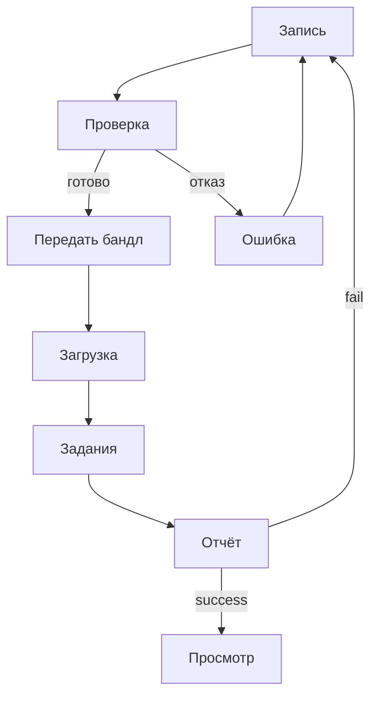

# Бизнес-анализ: система создания игровых 3D-карт по видеозаписи

**Продукт:** NVC Maps  
**English:** A System for Creating 3D Game Maps from Video

Сайт с разделами и экранами: [kalashnikovkv.github.io/nvc-business-analysis](https://kalashnikovkv.github.io/nvc-business-analysis/)

Требования взяты из технического задания и чертежа пайплайна. Здесь они записаны для продукта: кто пользуется системой, что входит в релиз и как это проверить.

---

## 01. Резюме, проблема, цели

### 1.1 Резюме

NVC Maps превращает короткую съёмку участка на телефоне с LiDAR в пакет игровой карты: визуальный меш, коллизию и отчёт о качестве. Съёмка уходит на сервер, карта открывается в браузере. Сборщик проходит по коллизии и видит рядом исходный кадр. Разработчик игры забирает пакет в размерах датчика и сам выбирает масштаб персонажа.

### 1.2 Проблема

| Сейчас | Нужно |
|--------|--------|
| Есть видео реального места | Упрощённый визуал и отдельная коллизия в размерах, которые дал датчик |
| Карту собирают ручной фотограмметрией и правят в редакторе | Один прогон без ручной доводки геометрии |
| Чтобы понять, можно ли по карте ходить, ставят движок | Проверка в браузере |
| Нет единого пакета «визуал + коллизия + метрики» | Пакет из пяти файлов и явный отказ с причиной |

Ручная фотограмметрия с доводкой в редакторе не повторяется одной командой и не даёт единого пакета из визуала и коллизии.

### 1.3 Цель продукта

Система превращает короткую съёмку участка на телефоне с LiDAR в пакет карты. Пакет открывается в браузере, его забирают в игру.

1. Принять бандл съёмки: видео, позы, метаданные, метрическая глубина LiDAR.
2. Собрать пакет `map.glb`, `collision.glb`, `manifest.json`, `bounds.json`, `report.json` в размерах датчика.
3. Дать сборщику пройти по коллизии в браузере и увидеть исходный кадр рядом с мешем.
4. На непригодном входе вернуть отказ с причиной. Геометрия-заглушка вместо карты не подставляется.

### 1.4 Видение

> Снял участок около 80×80 см, сервис собрал карту, проверил её ходьбой в браузере, забрал пакет и сам выставил масштаб персонажа.

### 1.5 Критерии успеха

| ID | Метрика | Порог |
|----|---------|-------|
| KPI-1 | Проверка в браузере | Персонаж стоит на карте не менее 5 с, не проваливается и проходит её от края до края; рядом виден кадр съёмки |
| KPI-2 | Пакет карты | Оба файла открываются в браузере; в манифесте метры, ось Y вверх и факт центрирования; масштаб геометрии не менялся |
| KPI-3 | Сквозной сценарий | По публичному адресу проходят загрузка бандла, статус и просмотр карты |
| KPI-4 | Лёгкая карта | Визуал не больше 50 000 треугольников; коллизия не больше 25% от визуала и не меньше 100 граней; визуал до 25 МБ, коллизия до 8 МБ |
| KPI-5 | Честный отказ | Пригодная запись собирается, непригодная получает отказ с текстом причины; вместо карты не подставляется заглушка |
| KPI-6 | Повторяемость | Повторная сборка той же съёмки даёт тот же способ построения. Число треугольников расходится не больше чем на 15% |

Покрытие тестами и устройство поставки описаны в техническом задании.

### 1.6 Вне цели этого релиза

Полноценная игра. Обязательный показ в Unreal. Обучение собственной модели глубины. Android как платформа приёмки. Изменение масштаба карты под рост персонажа. Сборка без глубины LiDAR: она возможна только если этот способ включён в настройках и на приёмку релиза не влияет.

---

## 02. Стейкхолдеры, границы, альтернативы

### 2.1 Стейкхолдеры

Первые три строки — пользователи. Четвёртая — не пользователь: человек, который может случайно попасть на видео, и владелец снимаемого места.

| Роль | Интерес | Влияние | Что требуют |
|------|---------|---------|-------------|
| Оператор съёмки | Понять до отправки, годится ли запись, и не переснимать зону вслепую | Высокое: определяет качество входных данных | Зона на экране, проверка записи перед сохранением, понятная причина отказа |
| Сборщик карты | Запустить обработку без ручной сборки, прочитать отчёт и пройти по карте в браузере до передачи пакета | Высокое: основной пользователь системы | Загрузка бандла, очередь и статус, отчёт, ходьба по коллизии |
| Разработчик игры | Забрать пакет без ручной доводки геометрии и сам выбрать масштаб персонажа | Высокое: задаёт состав выходного пакета | Размеры от датчика и ось в манифесте, геометрия не масштабируется, лёгкие визуал и коллизия, оба файла открываются |
| Человек в кадре и владелец места | Не оказаться на видео и в материалах, которые потом смотрят другие | На функции почти не влияет. Лицо крупным планом останавливает выпуск записи | Снимать пол, стол или макет; в проверочных записях нет лиц крупным планом |

### 2.2 Границы релиза

#### Входит

- Съёмка на iPhone или iPad с LiDAR: зона, обход, проверка записи, отправка бандла на сервер
- Сборка карты в размерах датчика и отчёт с метриками
- Отказ на непригодном входе вместо произвольной геометрии
- Приём бандла, очередь заданий, статус и выдача пакета
- Задания, метрики и ссылки на файлы хранятся; сами файлы пакета лежат отдельно
- Браузер: загрузка бандла, список своих заданий, отчёт, просмотр карты и ходьба по коллизии рядом с исходным кадром
- Открытое описание обмена: что принимается, что отдаётся, примеры успеха и отказа
- Сервис открывается по публичной ссылке. Пароли в собранную программу не входят. Среду можно поднять заново
- Проверочные записи: две пригодные и две непригодные

#### Не входит

- Масштабирование карты под конкретный геймплей
- Полноценная игра и обязательная демонстрация в Unreal
- Обучение собственной модели глубины
- Android как платформа приёмки
- Отдельная панель администрирования
- Сборка без глубины LiDAR. Она запускается только если этот способ включён в настройках и на приёмку релиза не влияет

#### После релиза

Android в приёмке, текстуры, второй уровень детализации, собственная модель глубины.

### 2.3 Допущения

1. Для записи есть телефон с LiDAR.
2. Оператор и сборщик могут быть одним человеком.
3. Разработчик игры умеет открыть GLB.

### 2.4 Ограничения

1. Обязательная платформа съёмки — iOS и iPadOS на устройстве с LiDAR. Запись в симуляторе и в браузере не поддерживается.
2. Зона по умолчанию 80×80 см выбрана из-за объёма вычислений. Размер настраивается, пороги качества заданы для значения по умолчанию.
3. Обычный обход идёт с высоты около 0,5–0,8 м. Это способ съёмки, не причина отказа.
4. Пайплайн не меняет масштаб геометрии. Меш только центрируется, и это фиксируется в манифесте.
5. Формат карты задаёт glTF, съёмку — ARKit и LiDAR.

### 2.5 Альтернативы

| Вариант | Плюс | Минус для продукта |
|---------|------|--------------------|
| Ручная фотограмметрия с доводкой в редакторе | Привычный путь к мешу | Не повторяется одной командой и не даёт единого пакета из визуала и коллизии |
| Сборка только по картинке, без LiDAR | Не нужен датчик глубины | Нет надёжных размеров в метрах. Остаётся выключенным способом и не заменяет LiDAR |

**Выбор:** съёмка с LiDAR, сборка на сервере, пакет GLB и проверка коллизии в браузере.

---

## 03. Персоны, сценарии, варианты использования

### 3.1 Персоны

Оператор и сборщик могут быть одним человеком. У разработчика игры своего экрана нет.

#### Оператор съёмки

Снимает участок пола, стола или макета на телефоне с LiDAR. До отправки хочет понять, годится ли обход.

- **Цель:** получить бандл с видео, позами, метаданными и глубиной.
- **Боль:** не видно, что обход слишком короткий, зона слишком большая или пропала траектория камеры.

#### Сборщик карты

Отправляет бандл и следит за сборкой. Решает по отчёту и по ходьбе в браузере, отдавать ли пакет дальше.

- **Цель:** запустить сборку без ручной команды и пройти по карте до передачи пакета.
- **Боль:** отказ без текста; нельзя понять, держит ли коллизия, пока карту не откроют в игре.

#### Разработчик игры

Забирает пять файлов. Ему нужны метры как есть и лёгкая коллизия. Масштаб персонажа он выставляет сам.

### 3.2 Сценарии

#### Пригодная съёмка

| Шаг | Что происходит |
|-----|----------------|
| Начало | Оператор открывает запись и видит на полу рамку зоны около 80×80 см |
| Основной путь | Обходит зону 10–30 с. Проверка проходит, бандл уходит на сервер. Задание завершается успехом |
| Развилка | Если сборка падает, в отчёте видна причина, зону переснимают |
| Завершение | Сборщик проходит по карте от края до края и передаёт пакет разработчику игры |

#### Непригодная съёмка

| Шаг | Что происходит |
|-----|----------------|
| Начало | Запись короче 10 с, длиннее 30 с, снята с места без обхода или без корректных поз |
| Основной путь | Проверка на телефоне или сборка на сервере останавливается отказом |
| Ошибка | Причина видна одной фразой |
| Завершение | Оператор переснимает зону. Непригодная запись не становится картой |

#### Повторная отправка

| Шаг | Что происходит |
|-----|----------------|
| Начало | Загрузка оборвалась, сборщик отправляет тот же бандл снова |
| Основной путь | Сервер возвращает текущее задание |
| Развилка | Если первое задание уже упало, виден его отказ |
| Завершение | Вторая сборка не стартует, в списке одно задание |

#### Та же съёмка ещё раз

| Шаг | Что происходит |
|-----|----------------|
| Начало | Тот же бандл собирают заново |
| Основной путь | Сборка идёт ещё раз |
| Ошибка | Способ построения другой или число треугольников разошлось больше чем на 15% |
| Завершение | Тот же способ построения, расхождение по треугольникам не больше 15% |

### 3.3 Варианты использования

| Вариант | Предусловия | Основной поток | Результат или ошибка |
|---------|-------------|----------------|----------------------|
| Записать | Телефон с LiDAR, камера готова | Навести на участок, начать запись, обойти зону, остановить | Видео, позы, метаданные, глубина и якорь зоны |
| Проверить | Есть запись | Длительность 10–30 с, путь камеры не меньше 0,28 м, поворот не меньше 90°, зона не больше 0,92 м, есть позы и глубина | «Готово» или причина отказа и «Переснять» |
| Переснять | Проверка не прошла | Кнопка ведёт обратно в запись | Новый бандл |
| Отправить | Состав бандла проверен | Отправка с телефона или форма в браузере, постановка в очередь | Ошибка сбоя показана текстом. Повторная отправка того же бандла возвращает текущее задание |
| Отчёт | Есть задание | Статус, способ построения, метрики | На отказе — текст причины |
| Пройти по карте | Сборка успешна | Загружается коллизия, рядом кадр с той же камеры, размер персонажа задаётся при показе | Персонаж стоит на поверхности и проходит край–край |
| Забрать пакет | Сборка успешна | Скачать пять файлов | Масштаб персонажа выставляется в игре |

---

## 04. User stories и приоритеты

У каждой истории есть контекст, границы, критерии приёмки, допущение и риск. Ссылка ведёт на схему экрана.

### Must

#### US-1. Запись зоны

**Как** оператор, **я хочу** записать зону на телефоне с LiDAR, **чтобы** получить бандл с метрической глубиной.

- **Контекст:** до отправки нужно понять, годится ли обход.
- **Границы:** камера, зона, проверка записи, ошибка и пересъёмка.
- **Допущение:** устройство с LiDAR.
- **Риск:** оператор не видит, что обход слишком короткий.
- **Экраны:** [запись](wireframes/m1-record.html), [проверка](wireframes/m2-preflight.html), [ошибка](wireframes/m3-error.html).

**Критерии приёмки**

1. После начала записи зона фиксируется. По умолчанию её размер 0,8 м.
2. В пригодном бандле есть видео, позы, метаданные и глубина.
3. Проверка сообщает готовность или причину отказа: длительность, обход, размер зоны, позы, глубина.
4. При отказе есть «Переснять». Непригодная запись не уходит в успешную сборку.

#### US-2. Загрузка и задание

**Как** сборщик карты, **я хочу** отправить бандл и получить задание на сборку, **чтобы** не перечислять файлы вручную.

- **Контекст:** сборка запускается без ручной команды.
- **Границы:** отправка с телефона, форма загрузки в браузере, постановка в очередь.
- **Допущение:** бандл отвечает условиям пригодного входа.
- **Риск:** обрыв загрузки оставляет задание без статуса.
- **Экраны:** [загрузка](wireframes/b1-upload.html), [задания](wireframes/b2-jobs.html), [отправка](wireframes/m2-preflight.html).

**Критерии приёмки**

1. Состав бандла проверяется до отправки.
2. Эталонная пригодная съёмка завершается успехом.
3. Повторная отправка того же бандла возвращает текущее задание, вторая сборка не стартует.

#### US-3. Отчёт

**Как** сборщик, **я хочу** видеть в отчёте, прошла ли карта пороги качества, **чтобы** решать по отчёту, а не на глаз.

- **Контекст:** решение об отдаче пакета принимается по отчёту.
- **Границы:** статус задания и отчёт.
- **Допущение:** пороги заданы для зоны по умолчанию 80×80 см.
- **Риск:** отказ без текста причины.
- **Экран:** [отчёт](wireframes/b3-report.html).

**Критерии приёмки**

1. В отчёте есть статус и способ построения. Способ построения не заглушка.
2. Визуал не больше 50 000 треугольников. Коллизия не больше 25% от визуала и не меньше 100 граней.
3. Визуал до 25 МБ, коллизия до 8 МБ.
4. Есть способ построения и число треугольников, чтобы сравнить повторную сборку.
5. На непригодном входе — отказ с текстом причины.

#### US-4. Ходьба в браузере

**Как** сборщик карты, **я хочу** открыть готовую карту в браузере и походить по коллизии, **чтобы** проверить пакет до передачи.

- **Контекст:** для этой проверки игра не нужна.
- **Границы:** просмотр карты и исходный кадр рядом с мешем.
- **Допущение:** размер персонажа задаётся при показе.
- **Риск:** коллизия не держит персонажа.
- **Экран:** [просмотр](wireframes/b4-viewer.html).

**Критерии приёмки**

1. Персонаж стоит на поверхности не меньше 5 с, не проваливается и проходит карту от края до края.
2. Рядом с мешем виден кадр съёмки с той же камеры.
3. Размер персонажа меняется при показе и не меняет геометрию карты.

#### US-5. Пакет для игры

**Как** разработчик игры, **я хочу** забрать пакет и самому задать масштаб персонажа, **чтобы** получить карту в размерах датчика.

- **Контекст:** пайплайн отдаёт размеры датчика.
- **Границы:** пять файлов пакета.
- **Допущение:** разработчик умеет открыть GLB.
- **Риск:** пакет принят за карту другого размера.
- **Экран:** скачивание в [отчёте](wireframes/b3-report.html).

**Критерии приёмки**

1. Оба файла открываются.
2. В манифесте метры, ось Y вверх и факт центрирования.
3. Геометрия пайплайном не масштабировалась.

### Приоритеты

| | |
|--|--|
| **Must** | Съёмка с проверкой и отправкой бандла, очередь и отчёт, ходьба в браузере, пакет без изменения масштаба, публичная ссылка |
| **Should** | Краткая инструкция, как открыть GLB в Godot |
| **Could** | Второй уровень детализации |
| **Won't** | Полноценная игра, обязательный показ в Unreal, обучение своей модели глубины, Android в приёмке |

Сборка без глубины LiDAR на приёмку этого релиза не влияет.

---

## 05. Экраны и стиль

Схемы экранов: [`wireframes/index.html`](wireframes/index.html). Каждый экран связан со сценарием из раздела 03.

### 5.1 Стиль

| Токен | Значение | Назначение |
|-------|----------|------------|
| Акцент | `#00BFA5` | Основные кнопки, активные элементы |
| Успех | `#4CAF50` | Пройденная проверка, `success` |
| Внимание | `#FF9800` | Зона зафиксирована, идёт запись |
| Ошибка | `#EF5350` | Отказ, кнопка записи |
| Фон телефона | `#0B0D10` | Слой поверх камеры |
| Фон браузера | `#F7F8FA` | Страницы веб-клиента |

**Шрифты.** На телефоне системный шрифт. В браузере IBM Plex Sans для текста и IBM Plex Mono для идентификаторов и метрик.

**Сетка.** Телефон: экран 320 pt по ширине, поля 20 pt, отступ между блоками 16 pt; управление внизу, в пределах безопасной зоны. Браузер: шапка с навигацией, основная колонка с полями 22–24 px; формы не шире 520 px; метрики отчёта в карточках от 160 px; просмотр карты делится на 3D-область и боковую панель с кадром, на узком экране панель уходит вниз.

**Состояния компонентов:** обычное, фокус, недоступно, ожидание, ошибка, успех. Зона нажатия не меньше 44 pt.

### 5.2 Телефон

| Экран | Сценарий | Содержание |
|-------|----------|------------|
| [Сканирование](wireframes/m1-record.html) | Пригодная съёмка | Вкладки «Сканировать» и «Мои карты», шаги Зона → Запись → Обход → Проверка, статус AR, кнопка «Запись» / «Стоп» |
| [Карта готова](wireframes/m2-preflight.html) | Пригодная съёмка | Лист после остановки: проверка пройдена, «Отправить бандл» |
| [Лучше переснять](wireframes/m3-error.html) | Непригодная съёмка | Причина отказа и «Переснять» |
| [Мои карты](wireframes/m4-maps.html) | Пригодная съёмка | Пустой список либо карточка съёмки: отправить и удалить |

Из приложения съёмки бандл уходит на сервер. Карту в приложении не посмотреть: её открывают в браузере.

### 5.3 Браузер

| Экран | Сценарий | Содержание |
|-------|----------|------------|
| [Загрузка](wireframes/b1-upload.html) | Пригодная съёмка, повторная отправка | Файл бандла, проверка состава до отправки |
| [Задания](wireframes/b2-jobs.html) | Пригодная съёмка, повторная отправка, та же съёмка ещё раз | Список своих заданий с фильтром: в очереди, собирается, готово, отказ |
| [Отчёт](wireframes/b3-report.html) | Пригодная и непригодная съёмка | Статус, способ построения, метрики, текст ошибки; переход к карте и скачивание пакета |
| [Просмотр](wireframes/b4-viewer.html) | Пригодная съёмка | Ходьба по коллизии, исходный кадр рядом, размер персонажа задаётся при показе |

### 5.4 Переходы

### 5.5 Тексты ошибок

| Ситуация | Текст |
|----------|-------|
| Длительность | «Запись должна длиться от 10 до 30 секунд» |
| Нет обхода | «Нужен обход зоны: пройдите вокруг участка» |
| Зона слишком большая | «Зона слишком большая — снимите участок около 80×80 см» |
| Позы | «Нет корректной траектории камеры — переснимите при стабильном AR» |
| Глубина | «Нет кадров глубины LiDAR — нужен iPhone или iPad Pro» |
| Состав бандла | «В бандле не хватает файла: {имя}» |
| Задание не найдено | «Задание не найдено — проверьте ссылку» |
| Ошибка сервера | «Сервер не ответил — отправьте бандл ещё раз» |
| Сборка | «Сборка не удалась: {причина}» |

### 5.6 Чеклист доступности

- [ ] Контраст текста не ниже AA; статус передаётся не только цветом
- [ ] Зоны нажатия не меньше 44 pt
- [ ] У полей, кнопок и статусов есть подписи
- [ ] Формы браузера проходятся с клавиатуры, фокус виден
- [ ] Ошибки показаны текстом

---

## 06. Нефункциональные требования, риски, готовность

### 6.1 Нефункциональные требования

| ID | Требование | Как проверить |
|----|------------|---------------|
| NFR-1 | Повторная сборка той же съёмки даёт тот же способ построения. Число треугольников расходится не больше чем на 15% | Сравнение двух отчётов |
| NFR-2 | Пароли не попадают в материалы, которые можно скачать или собрать заново. В проверочных записях нет лиц крупным планом | Просмотр записей и проверка, что пароли задаются при запуске |
| NFR-3 | Успешная сборка не зависит от установленной игры | Ходьба в браузере |
| NFR-4 | Параметры прогона задаются настройками и повторяются | Повторный прогон с теми же настройками |
| NFR-5 | Сервис открывается по публичной ссылке и поднимается заново | Открытие по ссылке и повторный подъём |

### 6.2 Риски

| Риск | Влияние | Что делается |
|------|---------|--------------|
| Меш получается неузнаваемым | Высокое | Небольшая зона съёмки, обязательные позы, отказ вместо произвольной геометрии |
| Нет телефона с LiDAR под рукой | Высокое | Сохранённые пригодные и непригодные бандлы, сценарий проходит в браузере |
| Обработка требует много ресурсов | Среднее | Настраиваемый размер зоны, ограничение числа кадров и точек |
| Съёмка не проходит проверку | Среднее | Причина отказа на экране и в отчёте, оператор переснимает зону |
| Геометрию случайно масштабируют | Высокое | Масштаб не меняется, в манифесте фиксируется только центрирование |
| Загрузка оборвалась, задание без статуса | Среднее | Повторная отправка того же бандла возвращает текущее задание |

### 6.3 Зависимости

| Зависимость | Зачем |
|-------------|-------|
| iPhone или iPad с LiDAR | Съёмка |
| Хостинг | Публичная ссылка, хранение заданий и файлов, пароли |
| Сохранённые бандлы | Повторная сборка и проверка непригодного входа |
| Образ со сборкой карты | Сборка в контейнере |

### 6.4 Данные и персональные данные

- Снимается участок пола, стола или макета, без лиц крупным планом.
- В базе лежат съёмки, задания, метрики и ссылки на файлы. Сами файлы — в хранилище.
- Пароли от базы и хранилища задаёт хостинг, в образ они не попадают.
### 6.5 Готовность к приёмке

Продукт готов, когда:

1. Проверка записи на телефоне сообщает готовность или причину отказа.
2. Бандл уходит на сервер, по публичной ссылке видны статус и карта.
3. Сборщик проходит по коллизии в браузере, рядом виден исходный кадр.
4. Разработчик игры получает пакет в размерах датчика, геометрия не масштабировалась.
5. Карта укладывается в бюджеты треугольников и размера файлов.
6. Пригодная запись собирается, непригодная получает отказ с причиной.
7. Повторная сборка той же съёмки даёт тот же способ построения и близкое число треугольников.

Релиз не принимается, если успех получен подстановкой заглушки, карта доводится вручную после сборки, геометрия масштабируется, персонаж проваливается сквозь коллизию или непригодный вход завершился успехом.

Числовые пороги, тестовые случаи и контракт обмена — в техническом задании.
